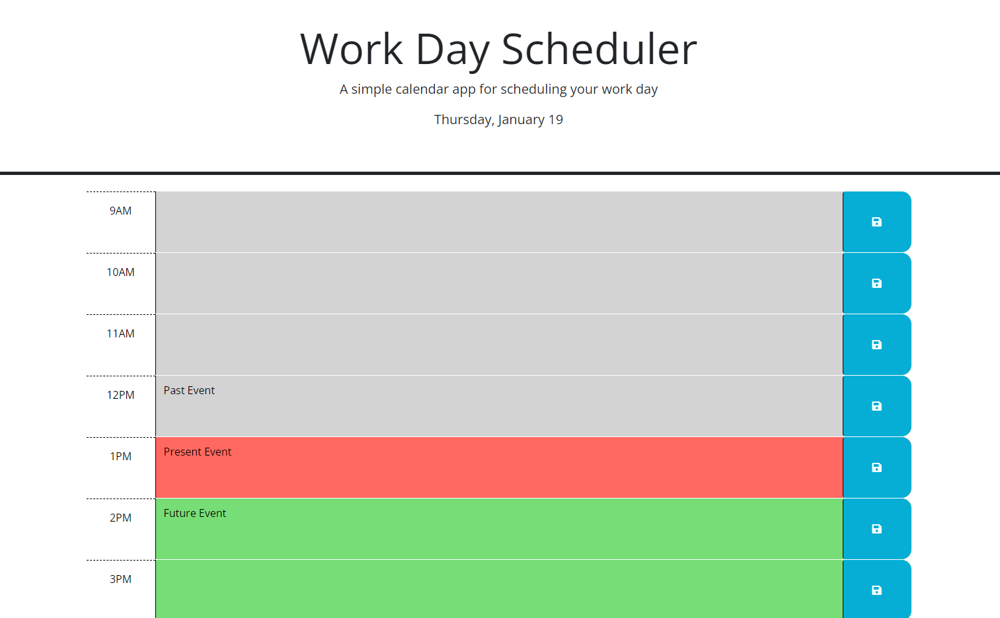

# Workday-Planner

## Description

User Story

AS an employee with a busy schedule

I WANT to add important events to a daily planner

SO THAT I can manage my time effectively

The goal for this application is to create a planner that a user can type on and save to localStorage even after refresh. The 
present time is displayed in red color, the past time is displayed in gray, and the future is displatyed in green. 
This image shows the default page for the workday planner application.

## Usage
Users can click to visit the website and use the planner by typing in the text area and saving it.
The website can be found at:
https://14chenj92.github.io/Workday-Planner/

## License
This repository uses a MIT License.
This application was made using HTML, CSS, Javascript, Bootstrap, and JQuery. 

## Credits
Made by Jonathan Chen 

https://github.com/14chenj92
